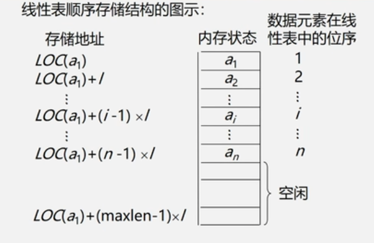

# 线性表

## 线性表的定义和特点

线性表是具有相同特性的数据元素的一个有限序列。

由n个数据元素(结点)a1,a2...an组成的有限序列。

其中数据元素的个数n定义为表的长度；

n=0称为空表；

非空的线性表(n>0)记作：(a1,a2,a3....an);

### 线性表的顺序存储定义

把逻辑上相邻的数据元素存储在物理上相邻的存储单元中的存储结构。

也就是逻辑上相邻，物理也相邻

线性表的顺序存储结构占用一片连续的存储空间。知道某个元素的存储位置就可以计算出其他元素的存储位置。

在顺序存储结构中，如果知道第一个元素的的存储位置，后面所有的元素的物理存储位置都可以知道

