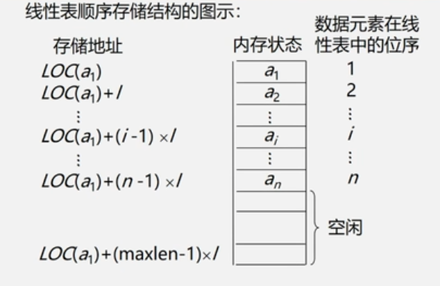
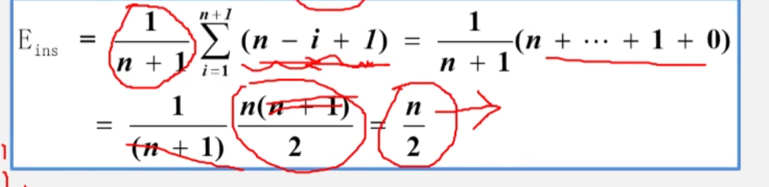
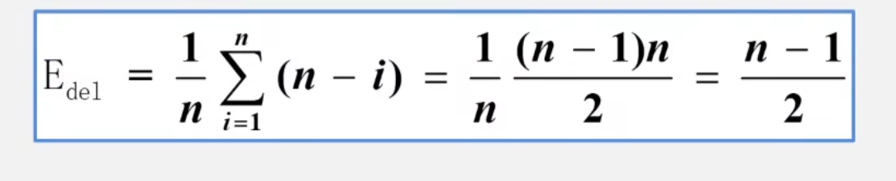

# 线性表

### 线性表的定义和特点

线性表是具有相同特性的数据元素的一个有限序列。

由n个数据元素(结点)a1,a2...an组成的有限序列。

其中数据元素的个数n定义为表的长度；

n=0称为空表；

非空的线性表(n>0)记作：(a1,a2,a3....an);

特点：

线性表的逻辑结构和存储结构一致

在访问线性表时，可以快速地计算出任何一个数据元素的存储地址。

这种存取元素的方法被称为随即存取发

## 线性表的顺序存储定义

把逻辑上相邻的数据元素存储在物理上相邻的存储单元中的存储结构。

也就是逻辑上相邻，物理也相邻

线性表的顺序存储结构占用一片连续的存储空间。知道某个元素的存储位置就可以计算出其他元素的存储位置。

在顺序存储结构中，如果知道第一个元素的的存储位置，后面所有的元素的物理存储位置都可以知道

### 顺序表的查找

按值查找：遍历顺序表中的元素

平均查找长度ASL:为了确定记录在表中的位置，需要与给定的值进行比较的关键字的个数的期望值叫做查找算法的平均查找长度

ASL = 
$$
ASL = \sum_{i=1}^nP_iC_i
$$
Pi是第i个记录被查找的概率

Ci是第i个记录需要比较的次数
$$
假设每个记录的查找概率相等，P_i = \frac{1}{n},
则ASL = \frac{1}{n}\sum_{i=1}^n = \frac{(n + 1)}{2}
$$

### 顺序表的插入

插入位置在最后：直接将数据放到最后

插入位置在中间和最前面：要挪动数据

考虑平均移动次数：

所以他的平均时间复杂度是O(n)

### 顺序表的删除

删除尾结点不需要处理

删除其他结点，n个元素删除第i个元素，需要移动n-i

所以他的平均时间复杂度为O(n)

### 总结

顺序表的操作算法分析：

时间复杂度：查找，插入，删除算法的平均时间复杂度都是O(n)

空间复杂度:O(1)没有占用辅助空间

优缺点：

优点：存储密度大（结点本身所占存储量/节点结构所占存储量）

可以随即存取表中任一元素

缺点：插入，删除元素需要移动大量元素

浪费存储空间

属于静态存储形式，数据元素个数不能自由扩充

## 链式存储结构

### 链式存储结构

结点在存储器中位置是任意的，即逻辑上相邻的数据元素在物理上不一定相邻

线性表的链式表示又称为非顺序映像或链式映像。

每一个节点由两个域组成：

数据域：存储元素的数值数据

指针域：存储直接后继结点的存储位置

相关术语：

结点：数据元素的存储映像，由数据域和指针域两部分组成

链表：n个节点由指针链组成一个链表，它是线性表的链式存储映像，称为线性表的链式存储结构

链式存储结构的特点

结点在存储器中的位置是任意的，即逻辑上相邻的数据元素在物理上不一定相邻。

访问时只能通过头指针进入链表，并通过每个结点的指针域依次向后顺序扫描其余结点，所以寻找第一个结点和最后一个结点所花费的时间不等

这种称为交顺序存取法

查找插入，删除算法的时间效率分析

查找：因线性链表只能顺序存取，即在查找时要从头指针找起，查找的时间复杂度为O(n)

插入和删除：因为线性链表不需要移动元素，只要修改指针，一般情况下复杂度为O(1),但是如果要在单链表中进行前插或者删除操作，由于需要从头查找前驱结点，所耗时间复杂度为O(n)

头插法建立单链表，从后往前顺序进行插入数据，先将最后元素插入到头结点之后，再将倒数第二个结点插入到头结点和最后一个结点中间，时间复杂度是O(n)

尾插法,正位许插入，将最后一个结点的next指向新结点
